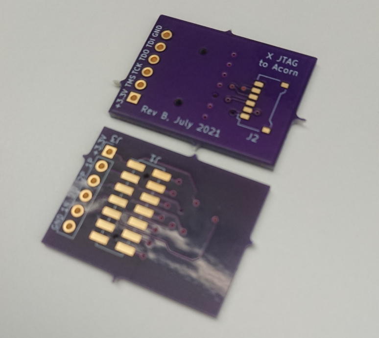
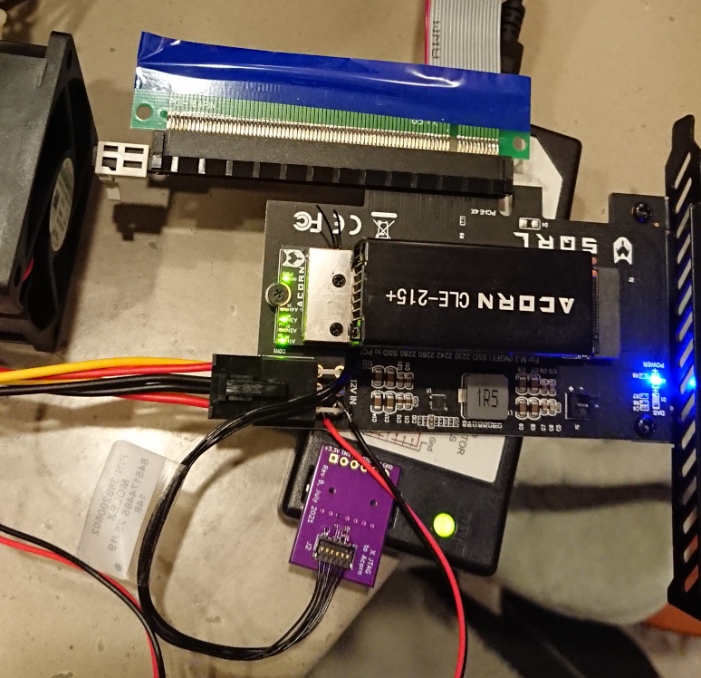

# AcornXJTAG
This is a small PCB for connecting the SQRL Acorn JTAG to a Xilinx pod. Tested with the first-generation Xilinx Platform Cable USB, manufactured via OSHPark.

## Bill of Materials
1. Pico-EZmate 6-pin, Molex 0781715006, Digi-Key WM5408CT-ND
1. 2x7 2mm receptacle, Molex 0787881414, Digi-Key WM26519-ND
1. Pico-EZmate 6-wire assembly 15cm, Molex 0369200602, Digi-Key WM26623-ND (other lengths available)

## Notes
* The Pico-EZmate connector is not really designed for hand soldering, 
but it doesn't really make sense to bother with a solder stencil for this board either.
The ones I soldered by hand, are pushed over slightly to give the soldering iron some room to work,
so the anchors are not accessible. I was too lazy to modify the footprint, which is an option. 
Otherwise I recommend adding glue or epoxy.
* The 2mm connector that comes with the OEM Xilinx flying-wire adapter is pretty tall.
I tried to find a similarly dimensioned connector but was unable to identify one that is commonly stocked.
The one specified here is widely available and seems to make good enough contact
with my Xilinx pod, but of course YMMV.
* This is revB since apparently I made revA under covid brain and forgot
that the Pico-EZmate cable assemblies are wired in a way that flips the connections...

## License
CERN OHL Permissive v2

